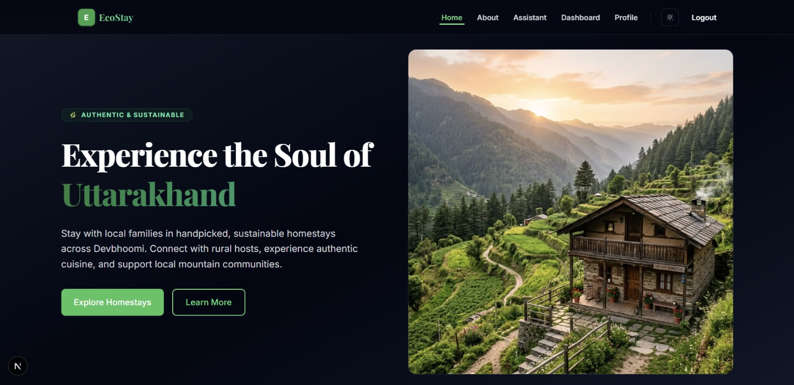
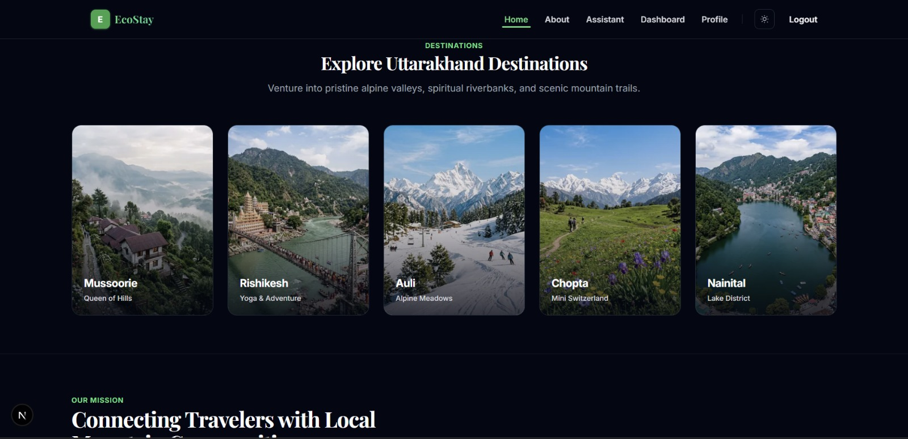
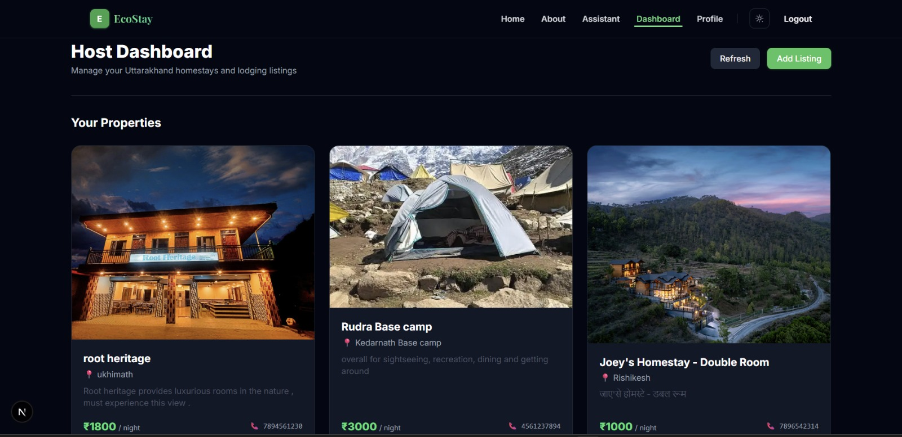
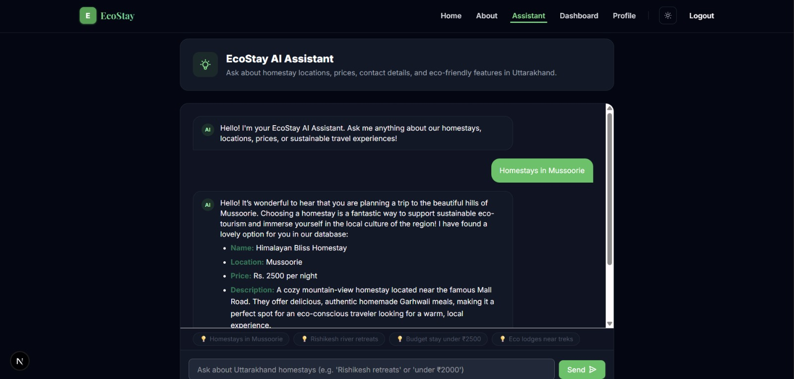

# EcoStay — Homestay & Eco-Tourism Platform

EcoStay is a full-stack homestay and eco-tourism platform focused on promoting authentic, sustainable homestays across Uttarakhand. The platform allows travelers to explore mountain retreats, host local listings, manage properties via a dedicated dashboard, authenticate securely, and consult an AI-powered travel assistant.

Built as an internship project submission at TBI GEU.

---

## Live Deployment

* **Frontend Client (Vercel):** [https://home-stay-eco-tourism.vercel.app](https://home-stay-eco-tourism.vercel.app)
* **Backend API Service (Render):** [https://ecostay-backend-1zgs.onrender.com](https://ecostay-backend-1zgs.onrender.com)

---

## Screenshots

### Landing Page

The EcoStay landing page introduces the platform with a Uttarakhand-focused visual design, featured destinations, and sustainable tourism highlights.



### Featured Destinations

The destination section allows travelers to explore popular Uttarakhand locations including Auli, Chopta, Mussoorie, Nainital, and Rishikesh.



### Host Dashboard

The authenticated host dashboard allows users to manage their homestay listings through create, read, update, and delete operations.



### AI Travel Assistant

The AI travel assistant uses Google Gemini and application data to provide context-aware recommendations for Uttarakhand homestays and travel queries.



---

## Features

### User Authentication
* **Local Session Management:** User registration and login with secure credentials.
* **Password Hashing:** Passwords securely hashed using `bcryptjs` before DB storage.
* **JWT Authorization:** Stateless API verification via Bearer JSON Web Tokens.
* **Google OAuth integration:** One-click Google login using `passport` and `passport-google-oauth20`.
* **Secured Client Gates:** Protected dashboard and profile pages.

### Homestay Management
* **Listing CRUD:** Hosts can create, view, edit, and delete their own properties.
* **Uttarakhand Destinations:** Interactive filters and location cards.
* **Local Contacts & Pricing:** Provides direct access to price-per-night and host details.

### AI Travel Assistant
* **Database-Driven Recommendations:** Connects to the homestay MongoDB database to extract real context.
* **Uttarakhand Travel Focus:** Custom-guided AI prompt engineering to avoid hallucinated recommendations.

### UI & Styling
* **Theme Support:** Clean, toggleable Light and Dark modes.
* **Responsive Layout:** Tailwind CSS layout scaling for desktop, tablet, and mobile displays.
* **Hydration Protection:** Smooth loading skeletons and empty state indicators.

---

## Tech Stack

### Frontend
* **Core:** Next.js (App Router, React 19)
* **Styling:** Tailwind CSS (v4)
* **Text Parser:** React Markdown
* **Context API:** Global State Management for Auth and Themes

### Backend
* **Server Framework:** Express.js (Node.js runtime)
* **Database Access:** Mongoose ODM (MongoDB Atlas)
* **Validation:** Zod
* **Rate Limiter:** `express-rate-limit` (applied to register/login routes)
* **AI Service:** Google Generative AI SDK (Gemini API)

### Database

- **MongoDB Atlas:** Cloud-hosted NoSQL database
- **Mongoose:** ODM for schema definition and database operations

### AI

- **Google Gemini API:** Powers the AI travel assistant and context-aware homestay recommendations.

### Deployment

- **Vercel:** Frontend hosting
- **Render:** Backend API hosting
- **MongoDB Atlas:** Cloud database hosting

---
## Project Architecture

```
EcoStay/
├── app/                      # Next.js App Router (Frontend)
│   ├── about/                # About page route
│   ├── assistant/            # AI assistant interface
│   ├── dashboard/            # Host listings manager
│   ├── login/                # Sign-in form
│   ├── profile/              # User account settings
│   ├── signup/               # Registration page
│   ├── layout.jsx            # Core HTML frame & font loading
│   └── page.jsx              # Landing page
├── components/               # Shared UI & Providers
│   ├── ui/                   # Modular buttons, inputs, loader, modal, toast
│   ├── AuthContext.jsx       # Auth state provider (JWT storage)
│   ├── ThemeProvider.jsx     # Dark mode provider
│   └── Navbar.jsx / Footer.jsx
├── backend/                  # REST API Server (Backend)
│   ├── config/               # Database, Passport, & Gemini setups
│   ├── controllers/          # Business logic (Auth, Homestays, AI)
│   ├── models/               # Mongoose MongoDB collections (User, Homestay)
│   ├── routes/               # API endpoint router files
│   └── server.js             # Main server entrypoint
```

---

## Local Development Setup

The frontend and backend run as separate, independent servers. You must configure and start both to run the application locally.

### 1. Configure Environment Variables
You must create environment configuration files prior to starting the servers.

* **Frontend Variables (`.env.local`):**
  Create a `.env.local` file in the **root** folder:
  ```env
  NEXT_PUBLIC_API_URL=http://localhost:5000
  ```

* **Backend Variables (`backend/.env`):**
  Create a `.env` file in the **`backend`** folder:
  ```env
  PORT=5000
  MONGO_URI=mongodb://localhost:27017/ecostay
  JWT_SECRET=your_development_jwt_secret_key_string
  JWT_EXPIRES_IN=7d
  CLIENT_URL=http://localhost:3000
  GOOGLE_CLIENT_ID=your_google_client_id_placeholder
  GOOGLE_CLIENT_SECRET=your_google_client_secret_placeholder
  GEMINI_API_KEY=your_gemini_api_key_placeholder
  ```

### 2. Startup Frontend (Root Folder)
Open a terminal in the project root:
```bash
# Install root/frontend dependencies
npm install

# Run frontend dev server (runs on http://localhost:3000)
npm run dev
```

### 3. Startup Backend (Backend Folder)
Open a second terminal in the project root:
```bash
# Navigate to backend
cd backend

# Install backend dependencies
npm install

# Run backend api server (runs on http://localhost:5000)
npm start
```

### 4. Database Seeding (Optional)
To pre-populate your local database with mock Uttarakhand homestays:
```bash
cd backend
node seedHomestays.js
```

---

## Environment Variables Reference

### Frontend (`.env.local`)
| Variable | Description | Example / Default |
| :--- | :--- | :--- |
| `NEXT_PUBLIC_API_URL` | Root URL of the Express API backend service. | `http://localhost:5000` |

### Backend (`backend/.env`)
| Variable | Description | Example / Default |
| :--- | :--- | :--- |
| `PORT` | Local port the Express API listens on. | `5000` |
| `MONGO_URI` | MongoDB connection URL (Atlas or Local). | `mongodb://...` |
| `JWT_SECRET` | Secret key used to sign and verify JSON Web Tokens. | *Keep secure* |
| `JWT_EXPIRES_IN` | Life cycle of generated JWT tokens. | `7d` |
| `CLIENT_URL` | Frontend URL allowed to query API (CORS whitelist). | `http://localhost:3000` |
| `GOOGLE_CLIENT_ID` | Client ID for Google OAuth authentication flow. | *From Google Console* |
| `GOOGLE_CLIENT_SECRET` | Secret key for Google OAuth authentication flow. | *From Google Console* |
| `GEMINI_API_KEY` | API Key used to connect to Google Generative AI. | *From Google AI Studio* |

---

## API Documentation

### 1. Authentication Endpoints (`/api/auth`)

#### Register User
* **Method:** `POST`
* **Route:** `/api/auth/register`
* **Auth Required:** No
* **Request Body:**
  ```json
  {
    "name": "Devendra Singh",
    "email": "devendra@example.com",
    "password": "securepassword123"
  }
  ```
* **Expected Response (201 Created):**
  ```json
  {
    "success": true,
    "message": "User registered successfully"
  }
  ```

#### Local Sign In
* **Method:** `POST`
* **Route:** `/api/auth/login`
* **Auth Required:** No
* **Request Body:**
  ```json
  {
    "email": "devendra@example.com",
    "password": "securepassword123"
  }
  ```
* **Expected Response (200 OK):**
  ```json
  {
    "success": true,
    "token": "eyJhbGciOi...",
    "user": {
      "id": "60d0fe24...",
      "email": "devendra@example.com",
      "name": "Devendra Singh"
    }
  }
  ```

#### Google OAuth Initialization
* **Method:** `GET`
* **Route:** `/api/auth/google`
* **Auth Required:** No
* **Purpose:** Redirects browser to Google account consent screen.

#### Google OAuth Callback
* **Method:** `GET`
* **Route:** `/api/auth/google/callback`
* **Auth Required:** No
* **Purpose:** Receives authentication ticket from Google, matches/creates user, and redirects user to `/login?token=<JWT>` on the frontend.

---

### 2. User Profile Endpoints (`/api/user`)

#### Get User Profile Details
* **Method:** `GET`
* **Route:** `/api/user/profile`
* **Auth Required:** Yes (Bearer JWT token in `Authorization` header)
* **Expected Response (200 OK):**
  ```json
  {
    "success": true,
    "user": {
      "id": "60d0fe24...",
      "name": "Devendra Singh",
      "email": "devendra@example.com",
      "createdAt": "2026-08-08T07:00:00.000Z"
    }
  }
  ```

#### Get Host Dashboard Metrics
* **Method:** `GET`
* **Route:** `/api/user/dashboard`
* **Auth Required:** Yes (Bearer JWT token in `Authorization` header)
* **Expected Response (200 OK):**
  ```json
  {
    "success": true,
    "message": "Welcome to your dashboard, Devendra Singh!",
    "stats": {
      "totalBookings": 0,
      "favoriteHomestays": 0,
      "memberSince": "2026-08-08T07:00:00.000Z"
    }
  }
  ```

---

### 3. Homestay Resource Endpoints (`/api/homestays`)

#### Fetch All Listings
* **Method:** `GET`
* **Route:** `/api/homestays`
* **Auth Required:** No
* **Expected Response (200 OK):**
  ```json
  [
    {
      "_id": "60d0fe25...",
      "name": "Chopta Eco Lodge",
      "location": "Chopta",
      "price": 1800,
      "description": "Budget-friendly eco lodge close to Tungnath trek.",
      "contact": "+91-9876543213",
      "image": "https://images.unsplash.com/...",
      "createdBy": null,
      "createdAt": "2026-08-08T07:00:00.000Z",
      "updatedAt": "2026-08-08T07:00:00.000Z"
    }
  ]
  ```

#### Fetch Single Listing
* **Method:** `GET`
* **Route:** `/api/homestays/:id`
* **Auth Required:** No
* **Expected Response (200 OK):**
  ```json
  {
    "_id": "60d0fe25...",
    "name": "Chopta Eco Lodge",
    "location": "Chopta",
    "price": 1800,
    "description": "Budget-friendly eco lodge close to Tungnath trek.",
    "contact": "+91-9876543213",
    "image": "https://images.unsplash.com/...",
    "createdBy": null
  }
  ```

#### Query Homestays (Search)
* **Method:** `GET`
* **Route:** `/api/homestays/search`
* **Auth Required:** No
* **Query Parameters:**
  * `location` (string, case-insensitive partial match)
  * `minPrice` (number)
  * `maxPrice` (number)
* **Expected Response (200 OK):** Returns matching array of homestays.

#### Fetch Host's Private Listings
* **Method:** `GET`
* **Route:** `/api/homestays/my-listings`
* **Auth Required:** Yes (Bearer JWT token in `Authorization` header)
* **Expected Response (200 OK):** Returns array of homestays created by the logged-in user.

#### Create New Listing
* **Method:** `POST`
* **Route:** `/api/homestays`
* **Auth Required:** Yes (Bearer JWT token in `Authorization` header)
* **Request Body:**
  ```json
  {
    "name": "Guptkashi Homestay",
    "location": "Guptkashi",
    "price": 2000,
    "description": "Scenic valley views with local organic Kumaoni food.",
    "contact": "+91-9988776655",
    "image": "https://images.unsplash.com/..."
  }
  ```
* **Expected Response (201 Created):** Returns created listing object.

#### Edit Listing
* **Method:** `PUT`
* **Route:** `/api/homestays/:id`
* **Auth Required:** Yes (Bearer JWT token; user must own listing)
* **Request Body:** Matches Create Request structure.
* **Expected Response (200 OK):** Returns updated listing object.

#### Delete Listing
* **Method:** `DELETE`
* **Route:** `/api/homestays/:id`
* **Auth Required:** Yes (Bearer JWT token; user must own listing)
* **Expected Response (200 OK):**
  ```json
  {
    "message": "Deleted successfully"
  }
  ```

---

### 4. AI Endpoint (`/api/ai`)

#### Query Travel Assistant
* **Method:** `POST`
* **Route:** `/api/ai/homestay-assistant`
* **Auth Required:** No
* **Request Body:**
  ```json
  {
    "message": "Find me a cottage in Rishikesh under 2500 rupees."
  }
  ```
* **Expected Response (200 OK):**
  ```json
  {
    "success": true,
    "reply": "I found **River View Retreat** in **Rishikesh** which costs **₹2200 per night**. It offers a peaceful stay beside the Ganga and homemade organic meals."
  }
  ```

---

## Deployment Guide

### 1. Frontend Client (Vercel)
* **Create Project:** Connect the GitHub repository branch.
* **Build Command:** `next build`
* **Output Directory:** `.next`
* **Environment Variables configuration:**
  * Configure `NEXT_PUBLIC_API_URL` to point to your live Render backend URL:
    `NEXT_PUBLIC_API_URL=https://ecostay-backend-1zgs.onrender.com`

### 2. Backend Service (Render)
* **Instance Type:** Web Service
* **Build Command:** `npm install` (run in sub-folder `backend`)
* **Start Command:** `npm start`
* **Environment Variables configuration:**
  * Add all `.env` variables:
    * `MONGO_URI`: Live MongoDB Connection string.
    * `JWT_SECRET`: A long random string.
    * `JWT_EXPIRES_IN`: `7d`
    * `CLIENT_URL`: Point to your live Vercel frontend URL (CORS whitelist):
      `CLIENT_URL=https://home-stay-eco-tourism.vercel.app`
    * `GEMINI_API_KEY`: API Key from Google AI Studio.
    * `GOOGLE_CLIENT_ID` / `GOOGLE_CLIENT_SECRET`: Credentials from Google Cloud Console.

### 3. CORS and Domain Management
* Ensure `CLIENT_URL` matches your frontend domain exactly without trailing slashes.
* If `CLIENT_URL` is omitted, the API CORS origin defaults to allowing `http://localhost:3000` for developer isolation.

---

## Free Tier Limitations
* **Render Sleep Cycle:** Render free instances spin down after 15 minutes of developer inactivity. Expect a delay of 50-60 seconds on the first request if the server is sleeping.
* **Atlas Resource Caps:** The free tier of MongoDB Atlas is limited to 512MB storage and shared CPU bandwidth.

---

## Credits & Acknowledgements

- Developed as part of the TBI-GEU internship program.
- Google Gemini API was used to power the AI-powered travel assistant.
- Next.js, React, Tailwind CSS, Express.js, MongoDB Atlas, and related open-source libraries were used to build the platform.
- Development and debugging were supported using AI-assisted development tools.